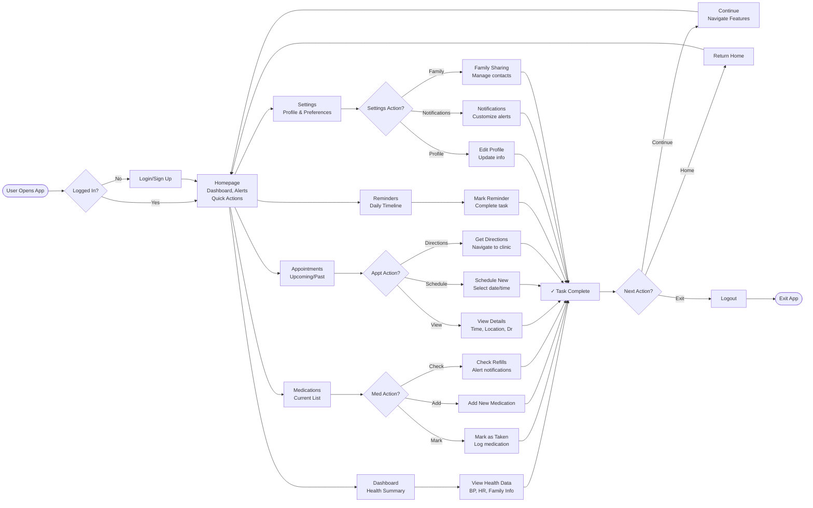

# Health Companion App - User Flow Chart

## Key User Journeys

### 1. Medication Management
User Opens App → Login/Sign Up → Homepage → Medications → Choose Action (Mark as Taken / Add New / Check Refills) → Task Complete → Decision (Continue, Return Home, or Logout)

### 2. Appointment Workflow
User Opens App → Login/Sign Up → Homepage → Appointments → Choose Action (View Details / Schedule New / Get Directions) → Task Complete → Decision (Continue, Return Home, or Logout)

### 3. Daily Check-In
User Opens App → Login/Sign Up → Homepage → Dashboard / Reminders → View Health Data / Mark Reminder → Task Complete → Continue navigating or Return Home

**Note:** The flow is circular - users can navigate between features and return to the Homepage at any time. Settings are accessible from the Homepage navigation bar.
